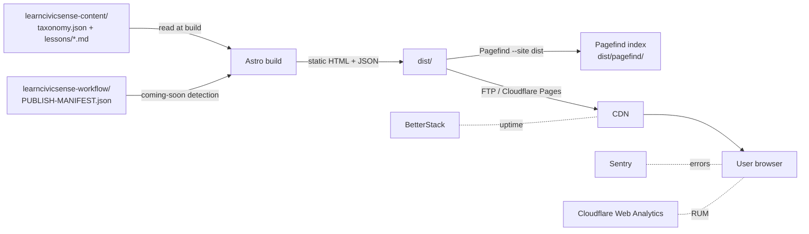

# Architecture

A mid-depth read of how the site is built, what runs at build time vs. at
request time, and where to look when something needs to change.

## High-level data flow



## Three layers, no surprises

| Layer                        | What it does                                                                                                                                              | Where                          |
| ---------------------------- | --------------------------------------------------------------------------------------------------------------------------------------------------------- | ------------------------------ |
| **Static HTML**              | The whole site renders at build time. Each of ~350 routes becomes an `index.html` shipped over CDN.                                                       | `src/pages/`, `dist/`          |
| **Per-component scoped CSS** | Astro scopes `<style>` blocks per `.astro` file. Shared tokens + reset live in `src/styles/`.                                                             | `src/styles/`, every component |
| **Preact islands**           | Five interactive surfaces (theme toggle, search overlay, sidebar accordion, TOC scroll-spy, lesson quiz) hydrate from JS chunks. Everything else is HTML. | `src/islands/`                 |

## Routing model

```
/                                      Homepage — 3 sections (India / Abroad / Visitors)
/[category]                            Category landing — opens the category card
/[category]/[subcategory]              Subcategory page — sidebar + article list
/[category]/[subcategory]/[article]    Article page — published OR coming-soon variant
/visitors                              Visitors-module placeholder (Phase 4)
/search                                Pagefind default UI as a fallback search surface
/about /privacy /terms /404            Static
```

The same `[article].astro` page handles real lessons and coming-soon stubs
(see ADR-006). Whether the body is real markdown or a placeholder card is
decided by `isArticlePublished()` in `src/lib/content.ts`.

## Source-of-truth contract

- **Taxonomy** drives every navigation surface: homepage, sidebar, category
  pages, article URLs, and the static-paths generator. Counts come from
  taxonomy too — we never re-derive "published vs planned" for nav.
- **Lessons** (.md files in the content repo) determine whether a single
  article renders its body or a coming-soon card. The lesson `id` (e.g.
  `traffic-001`) is the stable join key; filenames may differ.
- **Manifest** (`learncivicsense-workflow/PUBLISH-MANIFEST.json`) is the
  publish queue. After each rebuild Claude Code moves new entries into
  `previously_built_in` with a `built_at` timestamp.

## Tech stack one-liner per layer

| Layer       | Choice                                        | Why (full reasoning in ADRs)                                      |
| ----------- | --------------------------------------------- | ----------------------------------------------------------------- |
| Framework   | Astro                                         | Zero-JS by default, content-first, islands when needed. ADR-001   |
| Search      | Pagefind                                      | Static index built at deploy time, no server, no API key. ADR-002 |
| Hosting     | cPanel (current) → Cloudflare Pages (planned) | India edge presence + atomic deploys + free tier. ADR-003         |
| Font        | Hind family                                   | Indian foundry, multilingual, light, free. ADR-004                |
| Palette     | Teal primary + amber accent                   | Civic, calm, deliberately apolitical. ADR-005                     |
| Coming-soon | Build-time detection from taxonomy            | Volumetric nav without dead links. ADR-006                        |

## Performance budget

| Metric                                      | Target  | Measured                            |
| ------------------------------------------- | ------- | ----------------------------------- |
| Total JS (gzipped, worst-case article page) | ≤ 40 KB | **14.67 KB**                        |
| Total CSS (gzipped, all scoped)             | ≤ 30 KB | **6.35 KB**                         |
| Pagefind core (loaded on demand)            | ≤ 20 KB | **12.95 KB**                        |
| Lighthouse Performance (desktop)            | ≥ 95    | gated in `lighthouserc.json`        |
| Lighthouse Performance (mobile)             | ≥ 90    | gated in `lighthouserc.mobile.json` |

Targets enforced in CI via `size-limit` (`.size-limit.json`) and
`@lhci/cli` (`lighthouserc{,.mobile}.json`).

## Where to look for X

| To change...                                 | Edit...                                                       |
| -------------------------------------------- | ------------------------------------------------------------- |
| A color, spacing token, or breakpoint        | `src/styles/tokens.css`                                       |
| The article-page layout                      | `src/pages/[category]/[subcategory]/[article].astro`          |
| The homepage section structure               | `src/pages/index.astro` + `src/components/CategoryCard.astro` |
| Search behavior (UI)                         | `src/islands/SearchOverlay.tsx`                               |
| Search behavior (indexing)                   | `data-pagefind-*` attributes on article page                  |
| Taxonomy parsing or new content shape        | `src/lib/content.ts`                                          |
| SEO meta or JSON-LD                          | `src/lib/seo.ts`                                              |
| UI strings                                   | `src/i18n/en.json`                                            |
| Build flags (publish mode, launch allowlist) | `src/config.ts`                                               |

## What's deliberately NOT here

- User accounts, login, auth (no need for a reading library)
- Per-user state (favorites, bookmarks — hooks reserved in `ArticleHeader.astro`)
- Server-side anything (no API routes, no backend)
- Newsletter forms or PII collection at launch
- Real images (placeholders reserved, pipeline planned for Phase 3)
- Hindi or other Indian languages (planned for Phase 3; routing is locale-aware)
