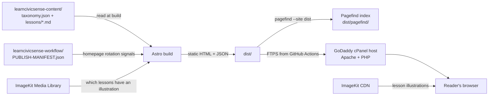

# Architecture

A mid-depth read of how the site is built, what runs at build time vs. at
request time, and where to look when something needs to change.

## High-level data flow


```mermaid
graph LR
  A[learncivicsense-content/<br/>taxonomy.json + lessons/*.md] -->|read at build| B[Astro build]
  C[learncivicsense-workflow/<br/>PUBLISH-MANIFEST.json] -->|homepage rotation signals| B
  K[ImageKit Media Library] -->|which lessons have an illustration| B
  B -->|static HTML + JSON| D[dist/]
  D -->|pagefind --site dist| E[Pagefind index<br/>dist/pagefind/]
  D -->|FTPS from GitHub Actions| F[GoDaddy cPanel host<br/>Apache + PHP]
  F --> G[Reader's browser]
  L[ImageKit CDN] -->|lesson illustrations| G
```

Deploys run from GitHub Actions (`docs/runbooks/deploy.md`): the full CI, an
FTPS upload of that exact build, then live verification. Error tracking
(Sentry) and analytics (Cloudflare Web Analytics) exist as code paths that
stay off unless their keys are set; no deploy sets them (the privacy page says
so). BetterStack uptime checks are described in
`docs/runbooks/observability-setup.md`.

## Four layers, no surprises

| Layer                        | What it does                                                                                                                                                                         | Where                          |
| ---------------------------- | ------------------------------------------------------------------------------------------------------------------------------------------------------------------------------------ | ------------------------------ |
| **Static HTML**              | The whole site renders at build time: about 235 pages, each an `index.html`, uploaded to the host as files.                                                                          | `src/pages/`, `dist/`          |
| **Per-component scoped CSS** | Astro scopes `<style>` blocks per `.astro` file. Shared tokens + reset live in `src/styles/`.                                                                                        | `src/styles/`, every component |
| **Preact islands**           | Six interactive surfaces (language menu, theme menu, search overlay, search page, TOC scroll-spy, lesson quiz) hydrate from JS chunks. Everything else is HTML.                      | `src/islands/`                 |
| **PHP on the host**          | Two small scripts: `404.php` answers every missing address with the site's 404 page and a real 404 status (ADR-010); `feedback.php` takes the feedback form and emails it (ADR-012). | `public/`                      |

## Routing model

```
/                          Homepage: hero, featured topics, every topic, who it is for
/[topic]/                  Topic page: every lesson in the topic, beside the topics sidebar
/[topic]/[lesson]/         Lesson page: published OR coming-soon variant
/topics/                   Every lesson, by topic
/visitors/                 Visitors-module placeholder (Phase 4)
/search/                   Search results page (?q= is shareable)
/feedback/                 Feedback form (+ /feedback/sent/ and /feedback/not-sent/ without JS)
/about/ /privacy/ /terms/  About the site
404                        Any missing address: the site's 404 page via 404.php
```

The site has two levels, topics and lessons (ADR-011). The taxonomy also groups
each topic's lessons into subtopics; that grouping only sets the order in which
a topic's lessons are listed, and has no pages. The addresses from before two
levels (`/{topic}/{subtopic}/` and `/{topic}/{subtopic}/{lesson}/`) redirect
permanently, from a frozen block in `public/.htaccess` that every deploy
re-checks.

The same `[article].astro` page handles real lessons and coming-soon stubs
(see ADR-006). Whether the body is real markdown or a placeholder card is
decided by `isArticlePublished()` in `src/lib/content.ts`.

## Source-of-truth contract

- **Taxonomy** drives every navigation surface: homepage, sidebar, topic
  pages, lesson URLs, and the static-paths generator, and sets the order of
  each topic's lessons. Counts come from taxonomy too — we never re-derive
  "published vs planned" for nav.
- **Lessons** (.md files in the content repo) determine whether a single
  article renders its body or a coming-soon card. The lesson `id` (e.g.
  `traffic-001`) is the stable join key; filenames may differ.
- **Manifest** (`learncivicsense-workflow/PUBLISH-MANIFEST.json`) is the
  publish queue, and its quality scores and publish dates feed the homepage's
  weekly rotation of featured topics (`src/lib/homepage-data.ts`). Once a
  deploy carrying new entries is verified, they move into
  `previously_built_in` with a `built_at` timestamp (CLAUDE.md).

## Tech stack one-liner per layer

| Layer       | Choice                                      | Why (full reasoning in ADRs)                                      |
| ----------- | ------------------------------------------- | ----------------------------------------------------------------- |
| Framework   | Astro                                       | Zero-JS by default, content-first, islands when needed. ADR-001   |
| Search      | Pagefind                                    | Static index built at deploy time, no server, no API key. ADR-002 |
| Hosting     | GoDaddy cPanel (Apache + PHP), FTPS deploys | The owner's host; supersedes the Cloudflare Pages plan. ADR-008   |
| Font        | Hind family                                 | Indian foundry, multilingual, light, free. ADR-004                |
| Palette     | Teal primary + amber accent                 | Civic, calm, deliberately apolitical. ADR-005                     |
| Coming-soon | Build-time detection from taxonomy          | Volumetric nav without dead links. ADR-006                        |
| Icons       | Lucide                                      | One stroke family for every icon. ADR-009                         |
| Structure   | Two levels, topics and lessons              | Most subtopics held one or two lessons. ADR-011                   |

## Performance budget

| Metric                                      | Target  | Measured                            |
| ------------------------------------------- | ------- | ----------------------------------- |
| Total JS (gzipped, worst-case article page) | ≤ 40 KB | **25.98 KB**                        |
| Total CSS (gzipped, all scoped)             | ≤ 30 KB | **14.68 KB**                        |
| Pagefind core (loaded on demand)            | ≤ 20 KB | **12.85 KB**                        |
| Lighthouse Performance (desktop)            | ≥ 95    | gated in `lighthouserc.json`        |
| Lighthouse Performance (mobile)             | ≥ 90    | gated in `lighthouserc.mobile.json` |

Measured with `npm run size` on 2026-09-29. Targets enforced in CI via
`size-limit` (`.size-limit.json`) and `@lhci/cli` (`lighthouserc{,.mobile}.json`).

## Where to look for X

| To change...                                 | Edit...                                                                               |
| -------------------------------------------- | ------------------------------------------------------------------------------------- |
| A color, spacing token, or breakpoint        | `src/styles/tokens.css`                                                               |
| The logo, favicon, app icons, share image    | `src/assets/logo.svg`, then `npm run brand:assets` (`scripts/build-brand-assets.mjs`) |
| The lesson-page layout                       | `src/pages/[category]/[article].astro`                                                |
| The topic-page layout                        | `src/pages/[category]/index.astro`                                                    |
| The homepage section structure               | `src/pages/index.astro` + `src/components/FeaturedCluster.astro`                      |
| Search behavior (UI)                         | `src/islands/SearchOverlay.tsx` + `src/islands/SearchPage.tsx`                        |
| Redirects for old addresses                  | the frozen block in `public/.htaccess` (ADR-011)                                      |
| The 404 page                                 | `src/pages/404.astro` + `public/404.php` (ADR-010)                                    |
| The feedback form                            | `src/pages/feedback/` + `public/feedback.php` (ADR-012)                               |
| About, Privacy, Terms                        | `src/layouts/InfoLayout.astro` + `src/components/InfoSection.astro`                   |
| Search behavior (indexing)                   | `data-pagefind-*` attributes on article page                                          |
| Taxonomy parsing or new content shape        | `src/lib/content.ts`                                                                  |
| SEO meta or JSON-LD                          | `src/lib/seo.ts`                                                                      |
| UI strings                                   | `src/i18n/en.json`                                                                    |
| Build flags (publish mode, launch allowlist) | `src/config.ts`                                                                       |

## What's deliberately NOT here

- User accounts, login, auth (no need for a reading library)
- Per-user state (favorites, bookmarks — hooks reserved in `ArticleHeader.astro`)
- An application server or a database: the two PHP scripts above are the only
  code that runs on the host
- Newsletter forms, or asking readers for personal details (the feedback form
  asks for no name or email address)
- An image for every lesson: a lesson shows an illustration only when one named
  after its id is uploaded to ImageKit
- Hindi or other Indian languages: English only today (the top bar's language
  menu lists Hindi as coming soon)
