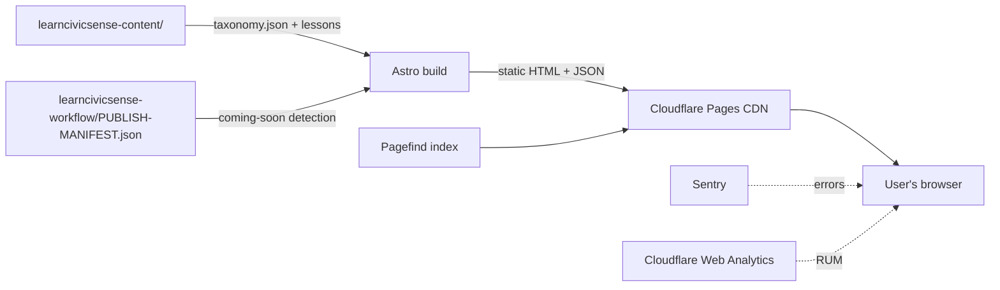

# learncivicsense.in — Production Readiness Spec

**Version:** 1.0
**Date:** 2026-06-02
**For:** Claude Code, to harden the current Astro + Pagefind + Cloudflare Pages build for public launch
**Status:** Ready to implement. Pairs with `WEBSITE-BUILD-SPEC.md` (v1, foundation) and `WEBSITE-BUILD-SPEC-v2-ADDENDUM.md` (volumetric navigation).

---

## How to use this document

This is the production-hardening layer on top of the existing build. The build itself is working: 13 articles live on localhost, taxonomy v2 deployed, manifest-based rebuild flow established. What this spec adds is everything a public-traffic site needs to be safe, fast, observable, maintainable, and ready to scale to thousands of multilingual articles.

Read top to bottom before implementing. The phasing matrix in Section 14 is the prioritization key: what blocks launch, what can land in the first month post-launch, what waits until content scale demands it.

---

## Table of contents

1. Constraints and design principles
2. Phasing overview
3. Code quality automation
4. Testing and validation
5. Performance and reliability
6. CI/CD and release
7. File system and folder layout for content scale
8. Architecture decisions and ADRs
9. Documentation standards
10. Security and privacy
11. SEO, sitemap, RSS, structured data
12. Image pipeline (for when real images replace placeholders)
13. Multilingual scaffolding (for when Hindi rolls out)
14. Phasing matrix: what lands when
15. Acceptance criteria
16. Appendix: example configs and workflow files

---

## 1. Constraints and design principles

**Hard constraints (locked):**

- **Free tier only.** Every tool in this spec works at no cost at the platform's current and foreseeable scale. No vendor lock-in beyond GitHub and Cloudflare (both have export paths).
- **60-90 day window** to production launch. Phase 1 of this spec must land in that window; Phase 2 hardening can follow post-launch.
- **Solo author + Claude Code as the only contributors.** Workflows are designed for this team size, with light scaffolding so future contributors can plug in without rework.
- **Static-only site.** No backend, no database, no server-side rendering. Everything is HTML+CSS+small JS islands generated at build time.
- **Quality over speed.** Lint failures, test failures, performance regressions, accessibility regressions — all block merge. No "we'll fix it later" merges.

**Design principles:**

1. **Every check that can be automated, is.** Human time is for content and editorial calls; machines catch the rest.
2. **Fail loudly in CI, fail safely in production.** Builds fail fast on quality regressions. Runtime errors are caught and logged but never crash the page.
3. **Observable from day one.** Cannot improve what you cannot measure. Analytics, error monitoring, uptime checks all running before launch.
4. **Reversible deploys.** Every deploy is atomic and instantly rollback-able. No half-shipped states.
5. **Future-self friendliness.** Code, docs, and architecture are written so the version of you (or a contributor) six months from now can navigate without context loss.

---

## 2. Phasing overview

Three phases. Each builds on the previous.

| Phase | Window | Goal | Must-have items |
|---|---|---|---|
| **Phase 1** | Now → launch (60-90 days) | Site is publicly launchable: safe, fast, observable, maintainable | TypeScript strict, ESLint, Prettier, husky, commitlint, Vitest, Playwright smoke tests, Lighthouse CI, bundle budgets, GitHub Actions CI/deploy, branch protection, preview deploys, sitemap, robots.txt, SEO meta, error monitoring, analytics, uptime monitoring |
| **Phase 2** | Launch + first month | Hardened against the edge cases real traffic surfaces | Accessibility CI (axe-core), broken link checker (lychee), visual regression, ADRs documented for past decisions, contributor docs polished, dependency audit automation |
| **Phase 3** | When content > 100 lessons or Hindi rolls out | Architecture proven at content scale | File system migration to per-lesson folders for multilingual, per-locale Pagefind indices, image pipeline activated, RSS feed, search analytics, content team workflows |

Section 14 has the detailed phasing matrix.

---

## 3. Code quality automation

The foundation. Nothing reaches main without passing every check below.

### 3.1 TypeScript strict mode

Set in `tsconfig.json`:

```json
{
  "extends": "astro/tsconfigs/strict",
  "compilerOptions": {
    "strict": true,
    "noUncheckedIndexedAccess": true,
    "exactOptionalPropertyTypes": true,
    "noImplicitOverride": true,
    "noPropertyAccessFromIndexSignature": true,
    "forceConsistentCasingInFileNames": true,
    "paths": {
      "@components/*": ["./src/components/*"],
      "@layouts/*": ["./src/layouts/*"],
      "@lib/*": ["./src/lib/*"],
      "@styles/*": ["./src/styles/*"],
      "@content/*": ["../learncivicsense-content/*"]
    }
  }
}
```

Every `.astro` component uses TypeScript in script blocks. No `any` types except at explicit external boundaries with a `// eslint-disable-next-line` and a comment explaining why.

`tsc --noEmit` runs in CI as a separate step. Failing types block merge.

### 3.2 ESLint

Install: `eslint`, `@typescript-eslint/eslint-plugin`, `@typescript-eslint/parser`, `eslint-plugin-astro`, `eslint-plugin-jsx-a11y`, `eslint-config-prettier`.

`.eslintrc.cjs`:

```js
module.exports = {
  root: true,
  parser: '@typescript-eslint/parser',
  plugins: ['@typescript-eslint', 'jsx-a11y'],
  extends: [
    'eslint:recommended',
    'plugin:@typescript-eslint/recommended',
    'plugin:astro/recommended',
    'plugin:jsx-a11y/recommended',
    'prettier',
  ],
  rules: {
    'no-console': ['error', { allow: ['warn', 'error'] }],
    '@typescript-eslint/no-explicit-any': 'error',
    '@typescript-eslint/no-unused-vars': ['error', { argsIgnorePattern: '^_' }],
    '@typescript-eslint/consistent-type-imports': 'error',
    'prefer-const': 'error',
    'no-var': 'error',
  },
  overrides: [
    {
      files: ['*.astro'],
      parser: 'astro-eslint-parser',
      parserOptions: { parser: '@typescript-eslint/parser', extraFileExtensions: ['.astro'] },
    },
  ],
};
```

Run `eslint . --ext .ts,.tsx,.astro,.js` in CI. Zero warnings tolerated on PR; treat warnings as errors with `--max-warnings 0`.

### 3.3 Prettier

`.prettierrc.json`:

```json
{
  "semi": true,
  "singleQuote": true,
  "trailingComma": "all",
  "printWidth": 100,
  "tabWidth": 2,
  "arrowParens": "always",
  "endOfLine": "lf",
  "plugins": ["prettier-plugin-astro"]
}
```

`.prettierignore` excludes `dist/`, `.astro/`, `node_modules/`, `coverage/`, content repo files, lockfiles.

Format check in CI: `prettier --check .` fails the build if anything is unformatted.

### 3.4 Pre-commit hooks (husky + lint-staged)

Install: `husky`, `lint-staged`.

`package.json`:

```json
{
  "scripts": {
    "prepare": "husky install"
  },
  "lint-staged": {
    "*.{ts,tsx,astro,js,mjs}": ["eslint --fix --max-warnings 0", "prettier --write"],
    "*.{json,md,css,yml,yaml}": ["prettier --write"]
  }
}
```

`.husky/pre-commit`:

```
#!/bin/sh
. "$(dirname "$0")/_/husky.sh"
npx lint-staged
```

`.husky/commit-msg`:

```
#!/bin/sh
. "$(dirname "$0")/_/husky.sh"
npx --no -- commitlint --edit "$1"
```

`.husky/pre-push`:

```
#!/bin/sh
. "$(dirname "$0")/_/husky.sh"
npm run typecheck && npm run test
```

This catches issues locally before they ever hit the CI.

### 3.5 Conventional commits (commitlint)

Install: `@commitlint/cli`, `@commitlint/config-conventional`.

`commitlint.config.js`:

```js
module.exports = {
  extends: ['@commitlint/config-conventional'],
  rules: {
    'subject-case': [2, 'always', 'sentence-case'],
    'body-max-line-length': [2, 'always', 100],
  },
};
```

Allowed types: `feat`, `fix`, `docs`, `style`, `refactor`, `perf`, `test`, `chore`, `ci`, `build`, `revert`.

Example commits:

```
feat: add per-locale Pagefind index builder
fix: resolve hydration mismatch in ThemeToggle island
docs: update CONTRIBUTING with new editorial workflow
ci: add bundle-size check to PR workflow
```

This pays off when generating changelogs and when scanning git history six months from now.

### 3.6 Stylelint (CSS)

Install: `stylelint`, `stylelint-config-standard`.

`.stylelintrc.json`:

```json
{
  "extends": "stylelint-config-standard",
  "rules": {
    "custom-property-pattern": "^--(color|space|text|leading|measure|radius|shadow|width|font-family)-",
    "selector-class-pattern": "^[a-z][a-zA-Z0-9-]*$",
    "no-descending-specificity": null
  }
}
```

Enforces the design-token naming convention from `WEBSITE-BUILD-SPEC.md` section 7.

---

## 4. Testing and validation

The five-layer test pyramid for a content site.

### 4.1 Content lint (already exists, integrate into CI)

The `learncivicsense-workflow/04-auto-lint/lint.py` script is the first gate. Run it in CI on every PR:

```yaml
- name: Content lint
  run: |
    pip install pyyaml
    python3 ../learncivicsense-workflow/04-auto-lint/lint.py --repo ../learncivicsense-content/
```

Any lint error blocks merge. The website build won't even be attempted if content is malformed.

### 4.2 Unit tests (Vitest)

Install: `vitest`, `@vitest/coverage-v8`, `@testing-library/dom`, `happy-dom` (lighter than jsdom).

`vitest.config.ts`:

```ts
import { defineConfig } from 'vitest/config';

export default defineConfig({
  test: {
    environment: 'happy-dom',
    globals: true,
    coverage: {
      provider: 'v8',
      reporter: ['text', 'html', 'json-summary'],
      thresholds: {
        statements: 80,
        branches: 75,
        functions: 80,
        lines: 80,
      },
      include: ['src/components/**/*.{ts,tsx}', 'src/lib/**/*.ts'],
    },
  },
});
```

What to test:

- **Islands:** theme toggle (state persistence, system preference detection), search overlay (query handling, keyboard navigation), sidebar accordion (expand/collapse, selection state, filter), TableOfContents (scroll-spy, anchor smooth-scroll), LessonQuiz (option selection, feedback reveal, no-score behavior)
- **Lib utilities:** content parsing (frontmatter shape validation), reading-time calc, slug generation, taxonomy traversal helpers, i18n string lookup with fallback
- **What NOT to test:** static `.astro` pages (covered by Playwright), CSS (covered by Stylelint and visual regression in Phase 2)

Run `vitest run --coverage` in CI. Coverage threshold failures block merge.

### 4.3 Integration / smoke tests (Playwright)

Install: `@playwright/test`.

`playwright.config.ts`:

```ts
import { defineConfig, devices } from '@playwright/test';

export default defineConfig({
  testDir: './tests/e2e',
  fullyParallel: true,
  forbidOnly: !!process.env.CI,
  retries: process.env.CI ? 2 : 0,
  workers: process.env.CI ? 2 : undefined,
  reporter: process.env.CI ? 'github' : 'list',
  use: {
    baseURL: process.env.PLAYWRIGHT_BASE_URL || 'http://localhost:4321',
    trace: 'on-first-retry',
    screenshot: 'only-on-failure',
  },
  projects: [
    { name: 'chromium', use: { ...devices['Desktop Chrome'] } },
    { name: 'mobile', use: { ...devices['Pixel 7'] } },
  ],
  webServer: process.env.CI
    ? undefined
    : { command: 'npm run preview', url: 'http://localhost:4321' },
});
```

Smoke test suite (`tests/e2e/smoke.spec.ts`):

```ts
import { test, expect } from '@playwright/test';

test.describe('Smoke', () => {
  test('homepage renders all categories', async ({ page }) => {
    await page.goto('/');
    await expect(page.getByRole('heading', { level: 1 })).toBeVisible();
    // Expect at least the launch categories to be visible
    await expect(page.getByRole('link', { name: /traffic/i })).toBeVisible();
    await expect(page.getByRole('link', { name: /public transport/i })).toBeVisible();
  });

  test('category page lists articles and shows sidebar', async ({ page }) => {
    await page.goto('/traffic/honking-discipline');
    await expect(page.getByRole('navigation', { name: /sidebar/i })).toBeVisible();
    await expect(page.getByRole('article')).toBeVisible();
  });

  test('article page renders TL;DR, body, and quiz', async ({ page }) => {
    await page.goto('/traffic/honking-discipline/the-case-against-honking');
    await expect(page.getByRole('heading', { name: /honking/i })).toBeVisible();
    await expect(page.getByText(/TL;DR/i)).toBeVisible();
  });

  test('search overlay opens and finds an article', async ({ page }) => {
    await page.goto('/');
    await page.getByRole('button', { name: /search/i }).click();
    await page.getByPlaceholder(/search/i).fill('honking');
    await expect(page.getByText(/case against honking/i)).toBeVisible({ timeout: 5000 });
  });

  test('theme toggle persists', async ({ page, context }) => {
    await page.goto('/');
    await page.getByRole('button', { name: /dark mode|light mode/i }).click();
    const themeAfterToggle = await page.evaluate(() => document.documentElement.dataset.theme);
    await page.reload();
    const themeAfterReload = await page.evaluate(() => document.documentElement.dataset.theme);
    expect(themeAfterReload).toBe(themeAfterToggle);
  });

  test('coming-soon article renders the placeholder', async ({ page }) => {
    // Pick a planned-but-not-published article ID from taxonomy
    await page.goto('/traffic/honking-discipline/honking-at-red-lights-and-what-it-costs-everyone');
    await expect(page.getByText(/coming soon|being written/i)).toBeVisible();
  });
});
```

Run on every PR against the Cloudflare preview deployment URL.

### 4.4 Accessibility (Phase 2: axe-core)

Install: `@axe-core/playwright`.

`tests/e2e/a11y.spec.ts`:

```ts
import { test, expect } from '@playwright/test';
import AxeBuilder from '@axe-core/playwright';

const pages = [
  '/',
  '/traffic',
  '/traffic/honking-discipline',
  '/traffic/honking-discipline/the-case-against-honking',
  '/queues-and-waiting/restaurants-and-buffets/the-buffet-line-is-not-a-competition',
  '/search?q=honking',
];

for (const path of pages) {
  test(`a11y: ${path}`, async ({ page }) => {
    await page.goto(path);
    const results = await new AxeBuilder({ page })
      .withTags(['wcag2a', 'wcag2aa', 'wcag21a', 'wcag21aa'])
      .analyze();
    const blocking = results.violations.filter((v) => ['serious', 'critical'].includes(v.impact));
    expect(blocking, JSON.stringify(blocking, null, 2)).toEqual([]);
  });
}
```

Serious or critical axe violations block merge.

### 4.5 Link integrity check (Phase 2: lychee)

Install via GitHub Action `lycheeverse/lychee-action`.

`.github/workflows/link-check.yml`:

```yaml
name: Link check
on:
  schedule:
    - cron: '0 3 * * 1' # Weekly Monday 3am UTC
  pull_request:
    paths:
      - 'src/**'
      - '../learncivicsense-content/**'

jobs:
  lychee:
    runs-on: ubuntu-latest
    steps:
      - uses: actions/checkout@v4
        with:
          submodules: true
      - name: Lychee link check
        uses: lycheeverse/lychee-action@v1
        with:
          args: >-
            --verbose --no-progress
            --exclude-mail
            --max-redirects 5
            --max-retries 2
            --retry-wait-time 3
            --timeout 15
            './**/*.md' './**/*.astro' './**/*.html'
          fail: true
```

Internal broken links block merge. External link failures generate warnings logged to a tracking issue.

### 4.6 Visual regression (Phase 2)

Playwright's built-in screenshot diff is enough for a content site. Snapshot one page per layout type:

```ts
test('homepage visual snapshot', async ({ page }) => {
  await page.goto('/');
  await expect(page).toHaveScreenshot('homepage.png', { maxDiffPixels: 100 });
});
```

Snapshots are committed to the repo under `tests/e2e/__screenshots__/`. CI fails on visual diff; designer commits intentional changes by re-running with `--update-snapshots`.

---

## 5. Performance and reliability

### 5.1 Lighthouse CI

Install: `@lhci/cli`.

`lighthouserc.json`:

```json
{
  "ci": {
    "collect": {
      "url": [
        "http://localhost:4321/",
        "http://localhost:4321/traffic/honking-discipline",
        "http://localhost:4321/traffic/honking-discipline/the-case-against-honking",
        "http://localhost:4321/search"
      ],
      "numberOfRuns": 3,
      "settings": {
        "preset": "desktop",
        "throttling": { "cpuSlowdownMultiplier": 1 }
      }
    },
    "assert": {
      "preset": "lighthouse:no-pwa",
      "assertions": {
        "categories:performance": ["error", { "minScore": 0.95 }],
        "categories:accessibility": ["error", { "minScore": 0.95 }],
        "categories:best-practices": ["error", { "minScore": 0.95 }],
        "categories:seo": ["error", { "minScore": 0.95 }],
        "uses-text-compression": "error",
        "uses-responsive-images": "warn",
        "total-byte-weight": ["error", { "maxNumericValue": 200000 }],
        "first-contentful-paint": ["warn", { "maxNumericValue": 2000 }],
        "largest-contentful-paint": ["error", { "maxNumericValue": 3000 }]
      }
    },
    "upload": { "target": "temporary-public-storage" }
  }
}
```

Run on every PR against preview deployment. Below-threshold scores fail the PR check.

Add a second config `lighthouserc.mobile.json` with `preset: 'mobile'` and slightly relaxed performance (≥0.90 minScore) because mobile throttling is harsher.

### 5.2 Bundle size budgets

Install: `size-limit`, `@size-limit/file`, `@size-limit/preset-app`.

`.size-limit.json`:

```json
[
  {
    "name": "Homepage JS bundle",
    "path": "dist/**/index.html.js",
    "limit": "30 KB",
    "gzip": true
  },
  {
    "name": "Article page JS bundle",
    "path": "dist/**/article.js",
    "limit": "40 KB",
    "gzip": true
  },
  {
    "name": "Total CSS",
    "path": "dist/**/*.css",
    "limit": "25 KB",
    "gzip": true
  },
  {
    "name": "Critical font (Hind Regular subsetted)",
    "path": "dist/fonts/hind-regular-latin.woff2",
    "limit": "20 KB"
  }
]
```

Run in CI. Budget overruns fail the build.

### 5.3 Analytics (Cloudflare Web Analytics, free, no cookies)

Add the Cloudflare Web Analytics beacon to `BaseLayout.astro` head:

```html
<!-- Cloudflare Web Analytics -->
<script
  defer
  src="https://static.cloudflareinsights.com/beacon.min.js"
  data-cf-beacon='{"token": "YOUR_TOKEN_HERE"}'
></script>
```

Token comes from Cloudflare dashboard. No cookies, no fingerprinting, GDPR-friendly by default.

Track: page views, geographic distribution, referrers, core web vitals (Cloudflare auto-collects). No custom events at launch.

If Plausible self-hosted is preferred later, the beacon swap is one HTML tag.

### 5.4 Error monitoring (Sentry, free tier 5K events/month)

Install: `@sentry/astro`, `@sentry/profiling-node`.

`astro.config.mjs`:

```js
import sentry from '@sentry/astro';

export default defineConfig({
  integrations: [
    sentry({
      dsn: process.env.SENTRY_DSN,
      environment: process.env.NODE_ENV,
      tracesSampleRate: 0.1,
      replaysSessionSampleRate: 0,
      replaysOnErrorSampleRate: 0.1,
      sourceMapsUploadOptions: {
        project: 'learncivicsense',
        authToken: process.env.SENTRY_AUTH_TOKEN,
      },
    }),
  ],
});
```

Source maps upload on every production deploy so stack traces are readable.

What gets captured: client-side JS errors in the islands. Static HTML pages can't error in production.

Alerts: email on new error types, threshold of 10 occurrences in 1 hour triggers immediate alert.

### 5.5 Uptime monitoring (BetterStack, free tier, 10 monitors)

Set up monitors via BetterStack dashboard:

1. `https://learncivicsense.in/` (homepage)
2. `https://learncivicsense.in/traffic/honking-discipline/the-case-against-honking` (canonical article)
3. `https://learncivicsense.in/search` (search page)
4. `https://learncivicsense.in/sitemap.xml` (sitemap reachable, signals build health)

Check interval: 3 minutes. Alert on 2 consecutive failures. Notifications to email + optional Slack.

Public status page (free with BetterStack): `https://status.learncivicsense.in` if desired.

### 5.6 Web Vitals tracking

Add to a small island that reports real-user metrics to Cloudflare Web Analytics:

```ts
// src/lib/web-vitals.ts
import { onCLS, onINP, onLCP, onFCP, onTTFB } from 'web-vitals';

function reportMetric(metric: { name: string; value: number; id: string }) {
  // Cloudflare Web Analytics auto-collects, this is a no-op fallback if needed
  if (typeof window === 'undefined') return;
  window.dispatchEvent(new CustomEvent('web-vital', { detail: metric }));
}

onCLS(reportMetric);
onINP(reportMetric);
onLCP(reportMetric);
onFCP(reportMetric);
onTTFB(reportMetric);
```

Cloudflare Web Analytics now collects RUM (real user metrics) natively, so this is optional. Include only if Plausible or another analytics replaces Cloudflare.

---

## 6. CI/CD and release

### 6.1 GitHub Actions workflows

Three workflows. All run on free tier.

**`.github/workflows/ci.yml`** (every PR):

```yaml
name: CI
on:
  pull_request:
    branches: [main]

jobs:
  lint-typecheck-test:
    runs-on: ubuntu-latest
    steps:
      - uses: actions/checkout@v4
        with: { submodules: true }
      - uses: actions/setup-node@v4
        with: { node-version: '20', cache: 'npm' }
      - uses: actions/setup-python@v5
        with: { python-version: '3.12' }
      - run: npm ci
      - run: pip install pyyaml
      - name: Content lint
        run: python3 ../learncivicsense-workflow/04-auto-lint/lint.py --repo ../learncivicsense-content/
      - name: Format check
        run: npm run format:check
      - name: ESLint
        run: npm run lint
      - name: Stylelint
        run: npm run stylelint
      - name: TypeScript
        run: npm run typecheck
      - name: Unit tests
        run: npm run test:unit -- --coverage
      - name: Bundle size
        run: npm run build && npx size-limit
      - uses: actions/upload-artifact@v4
        if: always()
        with: { name: coverage, path: coverage/ }
```

**`.github/workflows/e2e-lighthouse.yml`** (every PR, runs after preview deploys):

```yaml
name: E2E and Lighthouse
on:
  deployment_status:

jobs:
  e2e:
    if: github.event.deployment_status.state == 'success' && github.event.deployment_status.environment == 'preview'
    runs-on: ubuntu-latest
    steps:
      - uses: actions/checkout@v4
      - uses: actions/setup-node@v4
        with: { node-version: '20', cache: 'npm' }
      - run: npm ci
      - run: npx playwright install --with-deps chromium
      - name: Run Playwright smoke tests
        env:
          PLAYWRIGHT_BASE_URL: ${{ github.event.deployment_status.target_url }}
        run: npx playwright test
      - name: Lighthouse CI
        env:
          BASE_URL: ${{ github.event.deployment_status.target_url }}
        run: npx lhci autorun --config=lighthouserc.json
```

**`.github/workflows/deploy.yml`** (push to main):

```yaml
name: Deploy
on:
  push:
    branches: [main]

jobs:
  deploy:
    runs-on: ubuntu-latest
    environment: production
    steps:
      - uses: actions/checkout@v4
        with: { submodules: true }
      - uses: actions/setup-node@v4
        with: { node-version: '20', cache: 'npm' }
      - run: npm ci
      - name: Build
        env:
          SENTRY_AUTH_TOKEN: ${{ secrets.SENTRY_AUTH_TOKEN }}
        run: npm run build
      - name: Deploy to Cloudflare Pages
        uses: cloudflare/pages-action@v1
        with:
          apiToken: ${{ secrets.CLOUDFLARE_API_TOKEN }}
          accountId: ${{ secrets.CLOUDFLARE_ACCOUNT_ID }}
          projectName: learncivicsense
          directory: dist
          gitHubToken: ${{ secrets.GITHUB_TOKEN }}
      - name: Smoke test production
        run: |
          curl -fsSL https://learncivicsense.in/ > /dev/null
          curl -fsSL https://learncivicsense.in/sitemap.xml > /dev/null
```

**`.github/workflows/scheduled.yml`** (weekly):

```yaml
name: Scheduled health checks
on:
  schedule:
    - cron: '0 3 * * 1' # Monday 3am UTC
  workflow_dispatch:

jobs:
  link-check:
    runs-on: ubuntu-latest
    steps:
      - uses: actions/checkout@v4
        with: { submodules: true }
      - name: Lychee link check
        uses: lycheeverse/lychee-action@v1
        with:
          args: --verbose --no-progress --exclude-mail './**/*.md' './**/*.astro'
        continue-on-error: true
      - uses: peter-evans/create-issue-from-file@v5
        if: failure()
        with:
          title: 'Weekly link check found broken links'
          content-filepath: ./lychee/out.md
          labels: maintenance, broken-link

  dependency-audit:
    runs-on: ubuntu-latest
    steps:
      - uses: actions/checkout@v4
      - uses: actions/setup-node@v4
        with: { node-version: '20', cache: 'npm' }
      - run: npm ci
      - name: npm audit
        run: npm audit --audit-level=high
```

### 6.2 Branch protection on `main`

Set in GitHub repo settings → Branches → Protection rule:

- Require pull request before merging
- Require approvals: 1 (you, for now; Claude Code or contributors later)
- Dismiss stale approvals when new commits are pushed
- Require status checks to pass:
  - `lint-typecheck-test`
  - `e2e`
  - `lighthouse`
- Require branches to be up to date before merging
- Require linear history
- Include administrators (yes, hold yourself to the same standard)
- Restrict force pushes (yes)
- Restrict deletions (yes)

### 6.3 Preview deployments

Cloudflare Pages handles this natively. Every PR gets a unique preview URL of the form `https://<pr-hash>.learncivicsense.pages.dev`.

GitHub bot auto-comments the preview URL on each PR (Cloudflare Pages GitHub app handles this).

The E2E and Lighthouse workflows run against the preview URL, not localhost.

### 6.4 Atomic deployments and rollback

Cloudflare Pages makes every deploy immutable. To roll back:

- Cloudflare dashboard → Pages → learncivicsense → Deployments → click previous → "Rollback to this deployment"
- Or via API: `wrangler pages deployment list` then promote a previous deployment

Document the rollback procedure in `docs/runbooks/rollback.md`.

### 6.5 Secrets management

Use GitHub Actions secrets, not committed files:

- `CLOUDFLARE_API_TOKEN`
- `CLOUDFLARE_ACCOUNT_ID`
- `SENTRY_DSN` (public, fine to commit in `.env.example`)
- `SENTRY_AUTH_TOKEN` (for source map upload)

`.env.example` committed; `.env` gitignored. Document each in `CONTRIBUTING.md`.

---

## 7. File system and folder layout for content scale

The current layout works for English-only Phase 1. Section 13 covers the multilingual migration. For the website code itself, this is the layout:

```
learncivicsense-website/
├── README.md
├── ARCHITECTURE.md
├── CONTRIBUTING.md
├── CHANGELOG.md
├── LICENSE
├── .editorconfig
├── .gitignore
├── .gitattributes
├── .nvmrc                     Node version pin
├── package.json
├── package-lock.json
├── tsconfig.json
├── astro.config.mjs
├── playwright.config.ts
├── vitest.config.ts
├── lighthouserc.json
├── lighthouserc.mobile.json
├── .size-limit.json
├── .eslintrc.cjs
├── .prettierrc.json
├── .prettierignore
├── .stylelintrc.json
├── commitlint.config.js
├── .husky/
│   ├── pre-commit
│   ├── commit-msg
│   └── pre-push
├── .github/
│   ├── CODEOWNERS
│   ├── pull_request_template.md
│   ├── ISSUE_TEMPLATE/
│   │   ├── bug_report.md
│   │   ├── feature_request.md
│   │   └── content_issue.md
│   └── workflows/
│       ├── ci.yml
│       ├── e2e-lighthouse.yml
│       ├── deploy.yml
│       └── scheduled.yml
├── docs/
│   ├── README.md
│   ├── adrs/
│   │   ├── README.md
│   │   ├── 001-astro-over-nextjs.md
│   │   ├── 002-pagefind-over-algolia.md
│   │   ├── 003-cloudflare-pages-hosting.md
│   │   ├── 004-hind-font-family.md
│   │   ├── 005-design-token-palette.md
│   │   ├── 006-coming-soon-rendering.md
│   │   ├── 007-file-layout-multilingual.md
│   │   └── 008-pagefind-per-locale-indices.md
│   ├── runbooks/
│   │   ├── rollback.md
│   │   ├── add-locale.md
│   │   ├── add-category.md
│   │   └── incident-response.md
│   └── diagrams/
│       └── architecture.mermaid
├── public/
│   ├── fonts/                 self-hosted Hind woff2 subsets per locale
│   ├── icons/                 SVG sprite for Material Symbols (subsetted)
│   ├── images/                static images (logo, favicons)
│   ├── favicon.ico
│   ├── favicon.svg
│   ├── apple-touch-icon.png
│   ├── manifest.webmanifest
│   ├── robots.txt
│   └── humans.txt             nice-to-have credit page
├── src/
│   ├── components/
│   │   ├── README.md
│   │   ├── ui/                generic visual components (Chip, Badge, Card)
│   │   ├── layout/            BaseLayout, Header, Footer, Sidebar
│   │   ├── article/           ArticleHeader, ArticleBody, TldrBox, SourcesList, RelatedLinks
│   │   ├── islands/           interactive (ThemeToggle, SearchOverlay, SidebarNav, TableOfContents, LessonQuiz)
│   │   └── home/              CategoryCard, SubcategoryRow, HomeSection
│   ├── layouts/
│   │   ├── BaseLayout.astro
│   │   ├── ArticleLayout.astro
│   │   └── CategoryLayout.astro
│   ├── pages/
│   │   ├── index.astro
│   │   ├── [category]/
│   │   │   ├── index.astro
│   │   │   └── [subcategory]/
│   │   │       ├── index.astro
│   │   │       └── [article].astro
│   │   ├── search.astro
│   │   ├── about.astro
│   │   ├── 404.astro
│   │   └── rss.xml.ts
│   ├── content/
│   │   ├── config.ts          Astro content collection config
│   │   └── README.md
│   ├── lib/
│   │   ├── README.md
│   │   ├── content.ts         taxonomy + lessons loading
│   │   ├── reading-time.ts
│   │   ├── i18n.ts
│   │   ├── slug.ts
│   │   ├── url.ts             route helpers
│   │   ├── seo.ts             meta tag builders
│   │   └── search.ts          Pagefind config
│   ├── styles/
│   │   ├── tokens.css         design tokens (palette, type scale, spacing)
│   │   ├── reset.css
│   │   ├── global.css
│   │   └── print.css
│   ├── i18n/
│   │   ├── en.json            UI strings English
│   │   ├── hi.json            UI strings Hindi (Phase 2 when Hindi rolls out)
│   │   └── README.md
│   └── env.d.ts
├── tests/
│   ├── unit/                  Vitest specs (mirrors src/ structure)
│   ├── e2e/
│   │   ├── smoke.spec.ts
│   │   ├── a11y.spec.ts
│   │   ├── visual.spec.ts
│   │   └── __screenshots__/   Playwright snapshot baselines
│   └── fixtures/              test data (mock taxonomy entries, mock lessons)
└── scripts/
    ├── README.md
    ├── generate-sitemap.ts    optional custom sitemap generator
    ├── build-pagefind.ts      orchestrates per-locale Pagefind builds
    └── check-frontmatter.ts   complementary lint to lint.py for build-time validation
```

**Naming conventions:**

- File names: `kebab-case.ext` (e.g., `theme-toggle.ts`, `category-card.astro`)
- Component file names: `PascalCase.astro` for components, `kebab-case.ts` for utilities
- Folder names: `kebab-case`
- TypeScript: `kebab-case.ts` for utilities, `kebab-case.types.ts` for type-only files
- CSS class names: `kebab-case`, BEM-like where complexity warrants

**Co-location rule:** test files sit next to source for unit tests:

```
src/components/islands/theme-toggle.tsx
src/components/islands/theme-toggle.test.ts
```

E2E and visual regression tests live in `tests/e2e/` (they test cross-cutting flows, not single components).

---

## 8. Architecture decisions and ADRs

Every meaningful architectural choice gets an ADR. Markdown files in `docs/adrs/`, numbered.

### ADR template

```markdown
# ADR NNN: Decision title

**Status:** Accepted | Proposed | Deprecated | Superseded by ADR XXX
**Date:** YYYY-MM-DD
**Authors:** Name

## Context

What problem are we solving? What constraints exist?

## Decision

What we decided to do, in one paragraph.

## Alternatives considered

- Alternative A: why rejected
- Alternative B: why rejected

## Consequences

What we gain. What we accept. What we leave on the table for future revision.

## References

Links to relevant code, external docs, related ADRs.
```

### Initial ADRs to write (Phase 1)

| # | Title | Captures |
|---|---|---|
| 001 | Astro over Next.js | The zero-JS + content-first decision |
| 002 | Pagefind over Algolia | Static-search-no-server reasoning |
| 003 | Cloudflare Pages hosting | India edge latency + free tier + atomic deploys |
| 004 | Hind font family choice | Indian foundry, multilingual coverage |
| 005 | Design token palette | Teal + amber, dark/light, accessibility |
| 006 | Coming-soon article rendering | Manifest-driven, build-time detection |
| 007 | File layout for multilingual content | Per-lesson folders when Hindi arrives |
| 008 | Pagefind per-locale indices | Why we split search by language at scale |

ADRs are write-once mostly. Update only if superseded.

---

## 9. Documentation standards

### 9.1 Root `README.md`

Three-screens long. Covers:

- One-paragraph project description
- Quick start: 3 commands to run locally
- Tech stack one-liner
- Pointers: ARCHITECTURE.md, CONTRIBUTING.md, docs/adrs/
- Status badges: CI status, Lighthouse score, version, license

### 9.2 `ARCHITECTURE.md`

Mid-depth doc. Covers:

- System diagram (Mermaid or static image)
- Data flow: content repo → build → static site
- Key directories (one paragraph per top-level folder)
- Major dependencies (Astro, Pagefind, Cloudflare, etc.) with one-line justification
- Performance budget summary
- Pointers to all ADRs

### 9.3 `CONTRIBUTING.md`

Covers:

- Dev environment setup
- Branching model (trunk-based, short-lived feature branches)
- Commit conventions (link to commitlint config)
- PR template walkthrough
- How to add a component
- How to add a page
- How to add a new lesson (links to content repo)
- How to add a new locale (links to docs/runbooks/add-locale.md)
- Code review checklist

### 9.4 JSDoc / TSDoc on every public function

Example:

```ts
/**
 * Loads the taxonomy and returns the structured tree of categories,
 * subcategories, and planned articles.
 *
 * @remarks
 * Reads `../learncivicsense-content/01-taxonomy/taxonomy.json` at build time.
 * Throws if the file is missing or malformed. Used by every page route generator.
 *
 * @returns The full taxonomy v2 tree, with India clusters, abroad packs, and visitors module.
 * @throws {Error} If taxonomy.json is unreadable or schema-invalid.
 *
 * @example
 * ```ts
 * const taxonomy = await loadTaxonomy();
 * const traffic = taxonomy.clusters.find((c) => c.id === 'traffic');
 * ```
 */
export async function loadTaxonomy(): Promise<Taxonomy> { ... }
```

ESLint rule `tsdoc/syntax` enforces format.

### 9.5 README per major folder

`src/components/README.md`, `src/lib/README.md`, etc. Each:

- What lives here
- Naming/structure conventions
- Pointer to relevant ADRs if applicable
- "If you're adding X, here's where it goes"

These pay off when you (or a contributor) opens a folder six months from now without context.

### 9.6 Diagrams

`docs/diagrams/architecture.mermaid`:



Mermaid renders inline in GitHub.

---

## 10. Security and privacy

Static sites have minimal attack surface, but a few items must be right.

### 10.1 Security headers

Configure in Cloudflare Pages → Site settings → Headers, or via `public/_headers`:

```
/*
  Content-Security-Policy: default-src 'self'; script-src 'self' 'unsafe-inline' https://static.cloudflareinsights.com https://*.sentry.io; style-src 'self' 'unsafe-inline'; img-src 'self' data: https:; font-src 'self'; connect-src 'self' https://*.sentry.io https://static.cloudflareinsights.com; frame-ancestors 'none'; base-uri 'self'; form-action 'none'
  Strict-Transport-Security: max-age=31536000; includeSubDomains; preload
  X-Content-Type-Options: nosniff
  Referrer-Policy: strict-origin-when-cross-origin
  Permissions-Policy: camera=(), microphone=(), geolocation=(), payment=(), usb=()
  X-Frame-Options: DENY
```

Tighten the CSP `script-src` once it's stable (drop `unsafe-inline` if possible by using nonces).

### 10.2 Privacy

- **No tracking cookies.** Cloudflare Web Analytics is cookie-free. Sentry uses sessionStorage only.
- **No third-party fonts via Google Fonts CDN.** Self-hosted Hind woff2.
- **No social media trackers** (no Facebook Pixel, no GA, no LinkedIn Insight).
- **No newsletter forms at launch** (no PII collection).
- **Robots.txt allows all crawlers** (it's an educational platform; we want search indexing).

### 10.3 Privacy policy

`/privacy` page covers:

- What is collected (page views by Cloudflare, errors by Sentry — both anonymized)
- What is NOT collected (no PII, no cookies, no user accounts)
- Data retention (Cloudflare: 6 months; Sentry: 30 days on free tier)
- Contact for privacy inquiries

`/terms` page covers basic content licensing (CC BY-SA 4.0 recommended for civic education content) and platform usage.

### 10.4 Dependency security

- `npm audit` runs weekly in scheduled.yml
- Dependabot enabled in GitHub repo settings for security updates
- Pin major versions in package.json; allow minor/patch updates within bounds
- Re-evaluate dependencies quarterly; remove anything unused

---

## 11. SEO, sitemap, RSS, structured data

### 11.1 Sitemap

Install: `@astrojs/sitemap`.

`astro.config.mjs`:

```js
import sitemap from '@astrojs/sitemap';

export default defineConfig({
  site: 'https://learncivicsense.in',
  integrations: [
    sitemap({
      changefreq: 'weekly',
      priority: 0.8,
      lastmod: new Date(),
      filter: (page) => !page.includes('/draft/'),
      i18n: {
        defaultLocale: 'en',
        locales: { en: 'en-IN', hi: 'hi-IN' },
      },
    }),
  ],
});
```

Auto-generates `dist/sitemap-index.xml` and `dist/sitemap-0.xml` on every build.

### 11.2 robots.txt

`public/robots.txt`:

```
User-agent: *
Allow: /

Sitemap: https://learncivicsense.in/sitemap-index.xml
```

### 11.3 Meta tags per page

Every page sets:

- `<title>` (from frontmatter title + " · learncivicsense.in")
- `<meta name="description">` (from TL;DR first item or subcategory description)
- `<meta property="og:title">`, `og:description`, `og:image`, `og:type`, `og:url`
- `<meta name="twitter:card" content="summary_large_image">`
- `<link rel="canonical">`

Centralize this in `src/lib/seo.ts`:

```ts
export function buildMeta(opts: {
  title: string;
  description: string;
  image?: string;
  url: string;
  type?: 'article' | 'website';
}): MetaTag[] { ... }
```

### 11.4 Structured data (JSON-LD) on article pages

```html
<script type="application/ld+json">
{
  "@context": "https://schema.org",
  "@type": "Article",
  "headline": "{title}",
  "datePublished": "{last_updated}",
  "dateModified": "{last_updated}",
  "author": { "@type": "Organization", "name": "learncivicsense.in" },
  "publisher": { "@type": "Organization", "name": "learncivicsense.in" },
  "description": "{tldr[0]}",
  "articleSection": "{cluster.title}",
  "wordCount": {bodyWordCount},
  "inLanguage": "en-IN"
}
</script>
```

Helps Google Discover and other content surfaces.

### 11.5 RSS (Phase 3 when content updates regularly)

`src/pages/rss.xml.ts`:

```ts
import rss from '@astrojs/rss';
import { loadPublishedLessons } from '@lib/content';

export async function GET(context: any) {
  const lessons = await loadPublishedLessons();
  return rss({
    title: 'learncivicsense.in — new lessons',
    description: 'Civic-sense lessons for India.',
    site: context.site,
    items: lessons.slice(0, 50).map((l) => ({
      title: l.title,
      pubDate: new Date(l.last_updated),
      description: l.tldr.join(' • '),
      link: l.url_path,
    })),
    customData: '<language>en-IN</language>',
  });
}
```

---

## 12. Image pipeline (for when real images replace placeholders)

The current build uses image placeholders. When real images arrive, this is the pipeline.

### 12.1 Source images

- Store at `learncivicsense-content/05-images/{cluster}/{lesson-id}.{jpg,png}`
- Recommended source: 2000px wide, sRGB, 80% JPEG quality
- License: prefer original photography or CC0; for stock, document the source in image metadata

### 12.2 Build-time processing

Use Astro's `<Image>` component (built-in, uses sharp):

```astro
---
import { Image } from 'astro:assets';
import heroImage from '@content/05-images/traffic/traffic-001.jpg';
---
<Image
  src={heroImage}
  alt="Bengaluru intersection at peak hour, multiple cars honking with red light"
  widths={[400, 800, 1200]}
  sizes="(max-width: 600px) 100vw, 800px"
  format="webp"
  loading="lazy"
/>
```

Astro auto-generates AVIF + WebP + JPEG fallback, responsive srcset, lazy loading.

### 12.3 Alt text discipline

Every image gets meaningful alt text. Add a frontmatter field on lessons:

```yaml
image:
  src: traffic-001.jpg
  alt: "Bengaluru intersection at peak hour, multiple cars honking with red light"
  credit: "Photo: Original, CC0"
```

Build-time validation: lint.py extended to flag lessons that have an `image` block without alt text.

### 12.4 Lazy loading and prevent CLS

All images set explicit width/height attributes or aspect-ratio, so the browser reserves space and there's no layout shift when the image loads.

Hero image on article page: 16:9 aspect, lazy-loaded with `fetchpriority="high"` for above-the-fold.

---

## 13. Multilingual scaffolding (for when Hindi rolls out)

The current `.en.md` suffix pattern works for English-only. When Hindi adaptation begins, migrate to per-lesson folders.

### 13.1 Migration: from `slug.en.md` to per-lesson folders

Before (current):

```
02-clusters/traffic/lessons/
  traffic-001-the-case-against-honking.en.md
  traffic-002-honking-at-red-lights.en.md
  ...
```

After:

```
02-clusters/traffic/lessons/
  traffic-001-the-case-against-honking/
    en.md
    hi.md
    ta.md (future)
    ...
  traffic-002-honking-at-red-lights/
    en.md
    hi.md
    ...
```

Reasons:

- All locales of a lesson sit together → translation review is one folder open
- Easy to add a new locale: drop a file in
- Frontmatter consistency is enforceable across locales of the same lesson
- The Astro content collection reader handles both layouts; transition is non-breaking

Migration script: `scripts/migrate-to-folder-layout.ts` does this in one pass. Run when Hindi work begins. Document in `docs/runbooks/add-locale.md`.

### 13.2 Per-locale Pagefind indices

Pagefind supports multi-language indexing natively:

```sh
pagefind --site dist --output-subdir pagefind/en --root-selector "[data-pagefind-lang='en']"
pagefind --site dist --output-subdir pagefind/hi --root-selector "[data-pagefind-lang='hi']"
```

Each page sets `<html lang="en|hi">` and the Pagefind island detects the user's locale, loads the right index. Keeps index payloads small even at 1,688 lesson units.

Document the build script in `scripts/build-pagefind.ts`.

### 13.3 i18n string dictionaries

UI strings (nav labels, "TL;DR", "min read", "Sources", "Related lessons", search placeholders) live in `src/i18n/{locale}.json`:

```json
{
  "nav": {
    "home": "Home",
    "categories": "Categories",
    "paths": "Paths",
    "abroad": "Abroad",
    "visitors": "Visitors",
    "about": "About"
  },
  "article": {
    "tldr": "TL;DR",
    "sources": "Sources",
    "related": "Related lessons",
    "minRead": "min read",
    "lastUpdated": "Last updated"
  },
  "comingSoon": {
    "badge": "Coming soon",
    "message": "This lesson is being written. Expected in Phase {phase}.",
    "backLink": "← All lessons in {subcategory}"
  }
}
```

Load with fallback chain: requested locale → en → hard-coded key as last resort.

### 13.4 Per-locale fonts

Hind family: load only the subset needed for the active locale.

- Latin pages (English): Hind-Regular-Latin.woff2, Hind-Medium-Latin.woff2
- Devanagari pages (Hindi): Hind-Regular-Devanagari.woff2, Hind-Medium-Devanagari.woff2
- Tamil pages (future): Hind Madurai
- Etc.

The font CSS uses `unicode-range` to load only the relevant subset:

```css
@font-face {
  font-family: 'Hind';
  src: url('/fonts/hind-regular-latin.woff2') format('woff2');
  unicode-range: U+0000-00FF, U+0131, U+0152-0153, U+02BB-02BC, U+02C6, U+02DA, U+02DC, U+2000-206F, U+2074, U+20AC, U+2122, U+2191, U+2193, U+2212, U+2215, U+FEFF, U+FFFD;
  font-display: swap;
}

@font-face {
  font-family: 'Hind';
  src: url('/fonts/hind-regular-devanagari.woff2') format('woff2');
  unicode-range: U+0900-097F, U+1CD0-1CFF, U+200B-200C, U+202F, U+20A8, U+20B9;
  font-display: swap;
}
```

Browser loads only the subset it needs.

---

## 14. Phasing matrix: what lands when

Specific item-by-item priority.

| Item | Phase | Blocking? |
|---|---|---|
| TypeScript strict mode | 1 | Yes |
| ESLint + Prettier + Stylelint | 1 | Yes |
| husky pre-commit + commit-msg + pre-push | 1 | Yes |
| commitlint Conventional Commits | 1 | Yes |
| Vitest unit tests for islands (80% coverage threshold) | 1 | Yes |
| Playwright smoke tests | 1 | Yes |
| Content lint integrated into CI | 1 | Yes |
| Lighthouse CI with hard thresholds | 1 | Yes |
| Bundle size budgets (size-limit) | 1 | Yes |
| GitHub Actions: ci.yml, deploy.yml | 1 | Yes |
| Branch protection on main | 1 | Yes |
| Preview deployments | 1 | Yes |
| Cloudflare Web Analytics | 1 | Yes |
| Sentry error monitoring | 1 | Yes |
| BetterStack uptime monitoring | 1 | Yes |
| robots.txt, sitemap, canonical URLs, OG meta | 1 | Yes |
| JSON-LD structured data | 1 | Yes |
| Security headers (_headers file) | 1 | Yes |
| Privacy + Terms pages | 1 | Yes |
| README, ARCHITECTURE, CONTRIBUTING | 1 | Yes |
| Initial ADRs (001-006) | 1 | Yes |
| Sentry source map upload on deploy | 1 | Yes |
| Custom 404 page | 1 | Yes |
| Accessibility CI (axe-core) | 2 | No (run as warning until launch+30) |
| Broken link checker (lychee) | 2 | No (weekly scheduled) |
| Visual regression (Playwright screenshots) | 2 | No |
| Dependency audit automation (Dependabot + npm audit) | 2 | No |
| Status page (BetterStack public) | 2 | No |
| Issue templates and PR templates | 2 | No |
| ADRs 007 + 008 (multilingual decisions) | 3 | No |
| Per-lesson folder migration | 3 | When Hindi starts |
| Per-locale Pagefind indices | 3 | When Hindi starts |
| Image pipeline activated | 3 | When real images arrive |
| RSS feed | 3 | When 50+ lessons published |
| i18n dictionaries beyond en.json | 3 | When second locale rolls out |
| Per-locale font loading with unicode-range | 3 | When Hindi rolls out |
| Search analytics (which queries return zero results) | 3 | When traffic justifies |

---

## 15. Acceptance criteria

The implementation is "done" for Phase 1 when ALL of the following are true:

**Code quality**
- [ ] `npm run lint` reports zero errors and zero warnings
- [ ] `npm run typecheck` reports zero errors
- [ ] `npm run format:check` reports zero issues
- [ ] Pre-commit hooks block bad commits locally
- [ ] commitlint blocks non-conforming commit messages

**Testing**
- [ ] Vitest unit test coverage ≥80% statements, ≥75% branches, on islands and lib utilities
- [ ] Playwright smoke tests pass: homepage, category, article (real + coming-soon), search, theme toggle
- [ ] Content lint runs in CI and fails the build on lesson errors

**Performance**
- [ ] Lighthouse Performance ≥95 desktop, ≥90 mobile on homepage and one article per format
- [ ] Lighthouse Accessibility ≥95
- [ ] Lighthouse SEO ≥95
- [ ] Lighthouse Best Practices ≥95
- [ ] Bundle size budgets met (homepage JS ≤30KB gzipped, article JS ≤40KB gzipped)
- [ ] First Contentful Paint <2s on slow 3G simulation

**CI/CD**
- [ ] PRs cannot merge without passing CI, E2E, Lighthouse, and at least one review
- [ ] Every PR auto-deploys to a unique Cloudflare Pages preview URL
- [ ] Push to main triggers production deploy
- [ ] Source maps upload to Sentry on production deploys
- [ ] Rollback procedure tested and documented in `docs/runbooks/rollback.md`

**Observability**
- [ ] Cloudflare Web Analytics receiving page views from production
- [ ] Sentry receiving any deliberately-triggered test error from production
- [ ] BetterStack monitoring 4 endpoints, alerting configured
- [ ] Custom 404 page tracked

**Privacy and security**
- [ ] Security headers verified via `securityheaders.com` (A or A+ grade)
- [ ] No third-party trackers loaded
- [ ] No cookies set
- [ ] CSP passes Mozilla Observatory scan
- [ ] `/privacy` and `/terms` pages published

**Documentation**
- [ ] `README.md` reads cleanly with badges and quick-start
- [ ] `ARCHITECTURE.md` covers high-level design with diagram
- [ ] `CONTRIBUTING.md` walks through setup, contribution flow, conventions
- [ ] ADRs 001-006 written
- [ ] Every public function in `src/lib/` has TSDoc
- [ ] Every major folder has a README

**SEO and discovery**
- [ ] `/sitemap-index.xml` auto-generated and includes all routes
- [ ] `/robots.txt` allows all crawlers and links sitemap
- [ ] OG meta tags on every page
- [ ] JSON-LD on article pages
- [ ] Canonical URLs set everywhere

When all of these check off, the site is publicly launchable.

---

## 16. Appendix: example configs and workflow files

(All configs in sections 3-13 are intended to be copy-pasted directly. This appendix collects only the items that are too long to inline.)

### 16.1 `pull_request_template.md`

```markdown
## What does this PR do?

<!-- One paragraph. What changed, why. -->

## Type of change

- [ ] feat: new feature
- [ ] fix: bug fix
- [ ] docs: documentation only
- [ ] refactor: code change with no behavior change
- [ ] test: adding or improving tests
- [ ] perf: performance improvement
- [ ] chore: dependency or tooling change
- [ ] content: lesson or taxonomy update

## Checklist

- [ ] Tests added or updated
- [ ] Documentation updated if behavior changed
- [ ] No new ESLint or TypeScript warnings
- [ ] Lighthouse and bundle-size budgets respected
- [ ] If a public function was added, it has TSDoc
- [ ] If a new component was added, it has tests
- [ ] If a new page was added, it has a smoke test
- [ ] If a new ADR-worthy decision was made, an ADR was written

## Preview deployment

<!-- Cloudflare Pages bot will auto-comment the preview URL. Verify the change here. -->
```

### 16.2 `CODEOWNERS`

```
*       @rajatgarg
docs/   @rajatgarg
src/    @rajatgarg
```

(Adjust when contributors join.)

### 16.3 `.editorconfig`

```
root = true

[*]
indent_style = space
indent_size = 2
end_of_line = lf
charset = utf-8
trim_trailing_whitespace = true
insert_final_newline = true

[*.md]
trim_trailing_whitespace = false
```

### 16.4 `.gitignore`

```
node_modules/
dist/
.astro/
coverage/
playwright-report/
test-results/
.env
.env.local
*.log
.DS_Store
.vscode/
.idea/
```

### 16.5 `package.json` scripts (canonical)

```json
{
  "scripts": {
    "dev": "astro dev",
    "build": "astro build && npm run build:pagefind",
    "build:pagefind": "tsx scripts/build-pagefind.ts",
    "preview": "astro preview",
    "format": "prettier --write .",
    "format:check": "prettier --check .",
    "lint": "eslint . --ext .ts,.tsx,.astro,.js --max-warnings 0",
    "stylelint": "stylelint 'src/**/*.css'",
    "typecheck": "tsc --noEmit",
    "test": "vitest run",
    "test:unit": "vitest run",
    "test:watch": "vitest",
    "test:e2e": "playwright test",
    "test:a11y": "playwright test tests/e2e/a11y.spec.ts",
    "lhci": "lhci autorun",
    "size": "size-limit",
    "prepare": "husky install"
  }
}
```

### 16.6 `tsconfig.json` (full)

(Section 3.1 has the key compilerOptions; full file extends `astro/tsconfigs/strict` and adds the paths block.)

### 16.7 ADR-001 example: Astro over Next.js

```markdown
# ADR 001: Astro over Next.js

**Status:** Accepted
**Date:** 2026-05-25
**Authors:** Rajat Garg

## Context

learncivicsense.in is a content-heavy reading site with no dynamic backend, no auth, and a hard constraint to work on 2G connections. The site grows by adding markdown content, not by adding interactive features. Server-side rendering is unnecessary; static generation is sufficient.

## Decision

Use Astro as the framework. Build static HTML at build time, ship zero JavaScript by default, use Astro's islands architecture only for the four interactive components (theme toggle, search overlay, sidebar accordion, TOC scroll-spy, lesson quiz).

## Alternatives considered

- **Next.js:** Ships a React runtime to the client by default; turning that off requires careful work. Higher baseline JS payload than Astro. Excellent if SSR/RSC were needed; we don't need them. Rejected.
- **Hugo:** Pure static, very fast builds, but harder to add islands for interactivity (search overlay) without bolting on extra tooling. Astro's islands story is cleaner.
- **Eleventy:** Also pure static, mature, but the developer experience for adding interactive components is less integrated than Astro. Smaller ecosystem.
- **Plain HTML + JS:** No build step at all. Quickly becomes hard to maintain across 211+ lessons in 8 languages. Rejected.

## Consequences

- We commit to Astro's idioms (content collections, integrations API).
- The site will be exceptionally fast at any scale because most pages ship near-zero JS.
- When we eventually need any dynamic feature (e.g., user accounts), we add it as a separate service rather than rewriting the site.
- Hiring or contributor pool is smaller for Astro than React/Next.js; we accept that trade.

## References

- WEBSITE-BUILD-SPEC.md sections 2 and 3
- Astro docs: https://docs.astro.build/
```

---

## End of spec

When Phase 1 acceptance criteria are met, the site is production-launchable.
